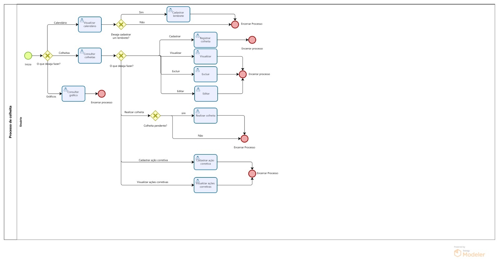

### 3.3.4 Processo 4 – Processo de Colheita

O Planejamento de Colheita é um processo que visa auxiliar o produtor, junto com as análises do Consultor agrônomo, realizar as atividades referentes ao processo de colheita, permitindo maior eficiência e registrar os produtos provenientes dessa etapa.

#### Detalhamento das atividades

**Consultar colheita**

_Exibe todas as colheitas cadastradas._

| **Campo**       | **Tipo**         | **Restrições** | **Valor default** |
| ---             | ---              | ---            | ---               |
| Imagem da Cultura | Imagem |     |                   |
| Imagem do Terreno | Imagem |     |                   |
| Nome da Cultura | Caixa de texto |     |                   |
| feedBack | Caixa de texto |     |                   |
| Condicao | Área de texto  |     |                   |               

| **Comandos**         |  **Destino**                   | **Tipo**          |
| ---                  | ---                            | ---               |
| Adicionar Ação Corretiva | Abre o modal de Cadastrar Ação Corretiva | default |
| Visualizar Ações Corretivas | Abre o modal de Visualizar Ações Corretivas | default |
| Realizar Colheita | Considera a colheita como realizada | default |
| Mostrar Detalhes | Amplia o modal para mostrar os demais detalhes | default |
| Editar |  Abre o modal de edição da colheita    |  default  |
| Excluir | Exclui a colheita do banco de dados | default |

**Visualizar**

_Permite o usuário ver informções referentes a uma colheita._

| **Campo**       | **Tipo**         | **Restrições** | **Valor default** |
| ---             | ---              | ---            | ---               |
| Imagem da Cultura | Imagem |     |                   |
| Imagem do Terreno | Imagem |     |                   |
| Nome da Cultura | Caixa de texto |     |                   |
| feedBack | Caixa de texto |     |                   |
| Condicao | Área de texto  |     |                   |   
| Data Inicio | Data  |     |                   | 
| Sacas | Número  |     |                   |
| Aprovação | aprovação  |     |                   |

| **Comandos**         |  **Destino**                   | **Tipo**          |
| ---                  | ---                            | ---               |
| Esconder Detalhes | Fecha a seção do card com as informações | default |

**Editar**

_Edita as informações já cadastradas._

| **Campo**       | **Tipo**         | **Restrições** | **Valor default** |
| ---             | ---              | ---            | ---               |
| Condição | Área de texto  |   |                   |
|  Sacas | Número  |             |                   |
| Aprovação  | Caixa de texto  |         |                   |
|  Feedback  | Caixa de texto  |   |    | 
|  Data  | Data  |   |    | 

| **Comandos**         |  **Destino**                   | **Tipo**          |
| ---                  | ---                            | ---               |
| Salvar  | Fecha o modal e altera as informações | default |
|   Cancelar   |  Fecha o modal, mas sem alterar as informações    |  Cancel  |

**Excluir**

_Permite excluir uma colheita existente._

| **Campo**       | **Tipo**         | **Restrições** | **Valor default** |
| ---             | ---              | ---            | ---               |
| Condição | Área de texto  |   |                   |
|  Sacas | Número  |             |                   |
| Aprovação  | Caixa de texto  |         |                   |
|  Feedback  | Caixa de texto  |   |    | 
|  Data  | Data  |   |    | 

| **Comandos**         |  **Destino**                   | **Tipo**          |
| ---                  | ---                            | ---               |

**Registrar colheita**

_Faz o registro de uma colheita e suas informações._

| **Campo**       | **Tipo**         | **Restrições** | **Valor default** |
| ---             | ---              | ---            | ---               |
| Nome da Cultura  | Seleção única  |   |                   |
| Nome do Terreno | Seleção única   |         |                   |
| Sacas | Número      |   |            0       |
| Data de Início | Data            |    |                   |
| Condição | Área de texto           |    |                   |

| **Comandos**         |  **Destino**                   | **Tipo** |
| ---                  | ---                            | ---               |
| Salvar | Fecha o modal e cadastra uma colheita | default |
|  Cancelar  |  Fecha o modal sem cadastrar uma colheita    |  Cancel  |

**Cadastrar ação corretiva**

_O usuário registra as ações corretivas._

| **Campo**       | **Tipo**         | **Restrições** | **Valor default** |
| ---             | ---              | ---            | ---               |
| Descrição | Área de texto  |    |                   |

| **Comandos**         |  **Destino**                   | **Tipo**          |
| ---                  | ---                            | ---               |
| Adicionar |  Fecha o modal e salva ações corretivas para aquela determinada colheita | default |
|   Cancelar   |   Fecha o modal sem salvar as ações corretivas |  Cancel  |

**Visualizar ações corretivas**

_O usuário visualiza todas as ações corretivas de uma colheita._

| **Campo**       | **Tipo**         | **Restrições** | **Valor default** |
| ---             | ---              | ---            | ---               |
| Id | Número  |    |                   |
| Descrição | Área de texto  |    |                   |

| **Comandos**         |  **Destino**                   | **Tipo**          |
| ---                  | ---                            | ---               |
|   Fechar   |   Fecha o modal |  Cancel  |

**Visualizar Calendário**

_Exibe eventos e lembretes do calendário de atividades._
| **Campo**              | **Tipo**         | **Restrições**    | **Valor default** |
|------------------------|------------------|-------------------|-------------------|
| Evento  | Seleção Única  | Opções como plantio e colheita     |           |
| Lembrete  | Área de Texto |      |       |

| **Comandos**         |  **Destino**                        | **Tipo**   |
|----------------------|-------------------------------------|------------|
| Selecionar Dia | Abre o sideBar Cadastrar Lembrete | default  |

**Cadastrar Lembrete**

_Permite cadastrar um lembrete e suas informações._
| **Campo**              | **Tipo**         | **Restrições**    | **Valor default** |
|------------------------|------------------|-------------------|-------------------|
| Título  | Caixa de Texto  |      |         |
| Descricao  | Área de Texto  |      |         |
| Data do Lembrete  | Data |  Data futura    | Data atual      |
| Status | Seleção Única |     |      |

| **Comandos**         |  **Destino**                        | **Tipo**   |
|----------------------|-------------------------------------|------------|
| Adicionar Lembrete     | Salva o lembrete e atualiza o calendário | default  |
| Deletar Lembrete  | Remove um lembrete existente e atualiza o calendário | default  |
| Editar Lembrete   | Edita um lembrete existente | default  |

**Consultar Gráfico**

_Permite o usuário visualizar dados sobre as sacas colhidas por meio de gráficos._
| **Campo**              | **Tipo**         | **Restrições**    | **Valor default** |
|------------------------|------------------|-------------------|-------------------|
| Sacas  | Número  |    |           |
| Nome da Cultura  | Caixa de Texto |      |       |
| Data de Inicio  | Data |      |       |

| **Comandos**         |  **Destino**                        | **Tipo**   |
|----------------------|-------------------------------------|------------|
| Sacas por Cultura   |   Abre o gráfico geral das sacas colhidas por cultura    | default            |
| Sacas por Terreno    |   Abre o gráfico das sacas colhidas por terreno e por data    | default            |

