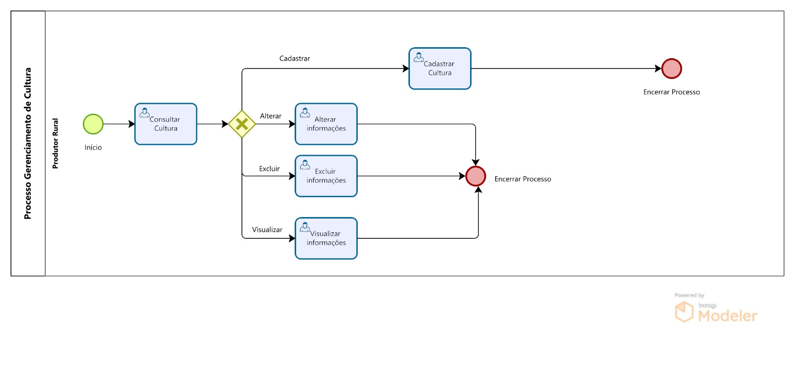

### 3.3.3 Processo de Gerenciamento de Cultura

O Gerenciamento de Cultura é um processo que consiste no controle das culturas agrícolas utilizadas pelo agricultor rural, permitindo o cadastro de informações relevantes e consultar tais dados. 

#### Detalhamento das atividades

**Consultar Cultura**

_Permite verificar informações de uma cultura e realizar ações._
| **Campo**       | **Tipo**         | **Restrições** | **Valor default** |
| ---             | ---              | ---            | ---               |
| Nome da Cultura | Caixa de Texto          |  |                |
| Descrição | Área de Texto | | |
| Imagem | Imagem      |  |                |

| **Comandos**         |  **Destino**                   | **Tipo** |
| ---                  | ---                            | ---               |
| Visualizar           | Direciona para o modal de Visualizar Informações  | default    |
| Adicionar Nova Cultura           | Direciona para o modal de Cadastrar Cultura  | default    |

**Cadastrar Cultura**

_Adiciona uma nova cultura e suas informações ao banco de dados._
| **Campo**       | **Tipo**         | **Restrições** | **Valor default** |
| ---             | ---              | ---            | ---               |
| Nome da Cultura| Caixa de texto | Caracteres, exceto "!@#$%&*" |     |
| Descrição | Área de Texto | Caracteres, exceto "!@#$%&*"| |
| Imagem (URL) | Caixa de Texto      |  |                |
| Tipo  | Caixa de texto  | Caracteres, exceto "!@#$%&*"           |                   |
| Tempo de Plantio  | Caixa de texto  | Caracteres, exceto "!@#$%&*" |                |

| **Comandos**         |  **Destino**                   | **Tipo**          |
| ---                  | ---                            | ---               |
| Salvar Cultura   | Fecha o modal e cadastra uma cultura | default  |
| Cancelar | Fecha o modal sem cadastra uma cultura | cancel |

**Alterar informações**

_Altera os dados de uma cultura já cadastrada, modificando suas informações._
| **Campo**       | **Tipo**         | **Restrições** | **Valor default** |
| ---             | ---              | ---            | ---               |
| Nome da Cultura | Caixa de texto | Caracteres, exceto "!@#$%&*" |     |
| Descrição | Área de Texto | Caracteres, exceto "!@#$%&*"| |
| Imagem (URL) | Caixa de Texto      |  |                |
| Tipo | Caixa de texto  | Caracteres, exceto "!@#$%&*"             |                   |
| Tempo de Plantio  | Caixa de texto  | Caracteres, exceto "!@#$%&*" |                |

| **Comandos**         |  **Destino**                   | **Tipo**          |
| ---                  | ---                            | ---               |
| Salvar alterações | Fecha o modal e altera as informações | default  |
| Cancelar | Fecha o modal, mas sem alterar as informações | cancel |

**Excluir Informações**

_Remove do sistema uma cultura já existente._
| **Campo**       | **Tipo**         | **Restrições** | **Valor default** |
| ---             | ---              | ---            | ---               |
| Nome da Cultura | Caixa de Texto          |  |                |
| Descrição | Área de Texto          |  |                |
| Imagem | Imagem          |  |                |
| Tipo | Caixa de Texto          |  |                |
| Tempo de Plantio | Caixa de Texto          |  |                |
| Tem certeza que deseja excluir a cultura? | Caixa de Texto          |  |                |

| **Comandos**         |  **Destino**                   | **Tipo**          |
| ---                  | ---                            | ---               |
| Confirmar exclusão      | Fecha o modal e exclui a cultura | default  |
| Cancelar | Fecha o modal, mas sem excluir a cultura | cancel |

**Visualizar Informações**

_Exibe uma lista completa das culturas já registradas no sistema._
| **Campo**       | **Tipo**         | **Restrições** | **Valor default** |
| ---             | ---              | ---            | ---               |
| Nome da Cultura | Caixa de Texto          |  |                |
| Descrição | Área de Texto          |  |                |
| Imagem | Imagem          |  |                |
| Tipo | Caixa de Texto          |  |                |
| Tempo de Plantio | Caixa de Texto          |  |                |

| **Comandos**         |  **Destino**                   | **Tipo**          |
| ---                  | ---                            | ---               |
| Editar           | Abre modal de Alterar Informações | default  |
| Fechar           | Fecha o modal | cancel  |
| Excluir           | Abre o modal de Excluir Informações | default  |

