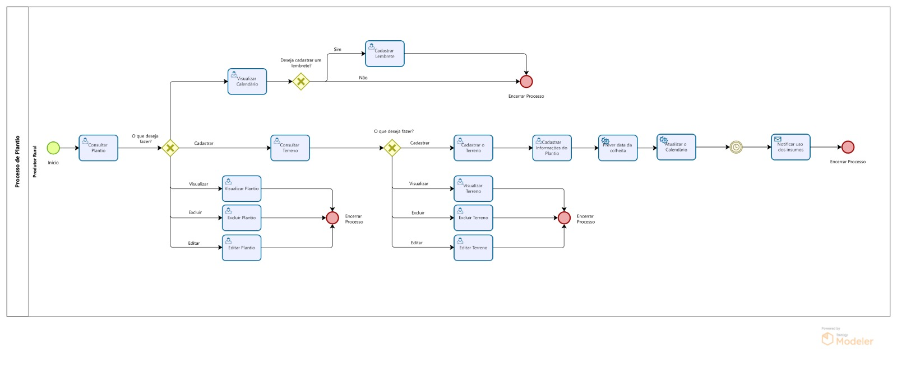

### 3.3.1 Processo de Plantio

O Gerenciamento de Plantio é um processo que permite o produtor rural ter uma visão sobre suas lavouras, por meio de um calendário gerado automaticamente, que contém as datas previstas para colheita, além de lembretes para se utilizar os insumos durante este processo. 

 

#### Detalhamento das atividades

**Consultar Plantio**

_Permite verificar informações de um plantio e realizar ações._
| **Campo**              | **Tipo**         | **Restrições**    | **Valor default** |
|------------------------|------------------|-------------------|-------------------|
| Tamanho do Terreno  | Caixa de Texto  |   |             |
| Nome da Cultura     | Caixa de Texto |   |  |
| Imagem da Cultura     | Imagem |  | |
| Imagem do Terreno     | Imagem |   | |

| **Comandos**         |  **Destino**                        | **Tipo**   |
|----------------------|-------------------------------------|------------|
| Ver Detalhes              | Direciona para o modal de Visualizar Plantio  | default    |
| Cadastrar Plantio             | Direciona para a tela Cadastrar Plantio    | default    |
| Visualizar Calendário            | Direciona para a tela Visualizar Calendário   | default    |

**Cadastrar Informações do Plantio**

_Cadastra um plantio e suas informações._
| **Campo**                | **Tipo**        | **Restrições**                                                | **Valor default** |
|--------------------------|-----------------|---------------------------------------------------------------|-------------------|
| Nome do Terreno       | Caixa de Texto |   |             |
| Nome da Cultura     | Caixa de Texto |   |   |
| Data de Plantio       | Data | Data futura   | Data atual        |
| Status do Terreno       | Caixa de Texto |    |        |
| Imagem do Terreno       | Imagem |    |        |
| Descrição da Cultura       | Caixa de Texto |    |        |
| Imagem da Cultura       | Imagem |    |        |

| **Comandos**         |  **Destino**                        | **Tipo**   |
|----------------------|-------------------------------------|------------|
| Salvar Plantio    | Cadastra as informações sobre aquele plantio no Banco de Dados e Direciona para a tela de Consultar Plantios   | default    |
| Cadastrar Terreno   | Abre a sideBar Cadastrar Terreno    |   default   |
| Detalhes (Cultura)       | Direciona para o modal de Visualizar Cultura  |  default  |        
| Detalhes (Terreno)       | Direciona para o modal de Visualizar Terreno |   default   |        

**Visualizar Plantio**

_Exibe todas as informações do plantio pelo Id._
| **Campo**       | **Tipo**         | **Restrições** | **Valor default** |
| ---             | ---              | ---            | ---               |
| Nome do Terreno       | Caixa de Texto  |  |             |
| Nome da Cultura     | Caixa de Texto |   | |
| Data de Plantio       | Data | Data futura   | Data atual        |
| Tamanho do Terreno       | Número  |  |   
| Imagem do Terreno       | Imagem  |   |   

| **Comandos**         |  **Destino**                   | **Tipo** |
| ---                  | ---                            | ---               |
| Editar | Direciona para o modal de Editar Plantio   | default |
| Excluir | Direciona para o modal de Excluir Plantio   | default |
| Fechar | Fecha o modal de Visualizar Plantio   | cancel |

**Excluir Plantio**

_Exclui um plantio pelo Id, com opção de cancelar._
| **Campo**       | **Tipo**         | **Restrições** | **Valor default** |
| ---             | ---              | ---            | ---               |
| Nome do Terreno       | Caixa de Texto  |  |             |
| Nome da Cultura     | Caixa de Texto |   | |
| Data de Plantio       | Data | Data futura   | Data atual        |
| Tamanho do Terreno       | Número  |  |   
| Imagem do Terreno       | Imagem  |   |   
| Tem certeza que deseja excluir o Plantio? | Caixa de Texto          |  |                |

| **Comandos**         |  **Destino**                   | **Tipo** |
| ---                  | ---                            | ---               |
| Confirmar Exclusão  | Fechar o modal e processa a exclusão do plantio   | default |
| Cancelar               | Fecha o modal mas sem processar a exclusão    | cancel           |

**Editar Plantio**

_Altera os dados de uma plantio já cadastrada, modificando suas informações._
| **Campo**       | **Tipo**         | **Restrições** | **Valor default** |
| ---             | ---              | ---            | ---               |
| Data do Plantio | Data | Data futura | Data atual        | 
| Nome do Terreno | Caixa de Seleção |  |         | 
| Status do Terreno | Caixa de Seleção |  |         | 
| Nome da Cultura | Caixa de Seleção |  |         | 

| **Comandos**         |  **Destino**                   | **Tipo** |
| ---                  | ---                            | ---               |
| Salvar  | Fecha o modal e atualiza o plantio com as novas informações   | default |
| Cancelar               | Fecha o modal sem salvar as alterações      |    cancel           |

**Visualizar Calendário**

_Exibe eventos e lembretes do calendário de atividades._
| **Campo**              | **Tipo**         | **Restrições**    | **Valor default** |
|------------------------|------------------|-------------------|-------------------|
| Evento  | Seleção Única  | Opções como plantio e colheita     |           |
| Lembrete  | Área de Texto |      |       |

| **Comandos**         |  **Destino**                        | **Tipo**   |
|----------------------|-------------------------------------|------------|
| Selecionar Dia | Abre o sideBar Cadastrar Lembrete | default  |

**Cadastrar Lembrete**

_Permite cadastrar um lembrete e suas informações._
| **Campo**              | **Tipo**         | **Restrições**    | **Valor default** |
|------------------------|------------------|-------------------|-------------------|
| Título  | Caixa de Texto  |      |         |
| Descricao  | Área de Texto  |      |         |
| Data do Lembrete  | Data |  Data futura    | Data atual      |
| Status | Seleção Única |     |      |

| **Comandos**         |  **Destino**                        | **Tipo**   |
|----------------------|-------------------------------------|------------|
| Adicionar Lembrete     | Salva o lembrete e atualiza o calendário | default  |
| Deletar Lembrete  | Remove um lembrete existente e atualiza o calendário | default  |
| Editar Lembrete   | Edita um lembrete existente | default  |

**Consultar Terreno** 

_Permite consultar todos os terrenos_
| **Campo**       | **Tipo**         | **Restrições** | **Valor default** |
| ---             | ---              | ---            | ---               |
| Imagem do Terreno      |   Imagem       |  |  |
| Nome do Terreno            | Caixa de Texto            |            |               |
| Status do Terreno            | Caixa de Texto            |         |              |

| **Comandos**         |  **Destino**                   | **Tipo**          |
| ---                  | ---                            | ---               |
| Detalhes           | Direciona para o modal de Visualizar Terreno  | default  |

**Visualizar Terreno**

_Permite visualizar a informação de um terreno_
| **Campo**       | **Tipo**         | **Restrições** | **Valor default** |
| ---             | ---              | ---            | ---               |
| Imagem do Terreno      |   Imagem       |  |  |
| Nome do Terreno            | Caixa de Texto            | ---            | ---               |
| Status do Terreno            | Caixa de Texto            | ---            | ---               |
| Tamanho do Terreno            | Caixa de Texto            | ---            | ---               |
| Tipo de Solo do Terreno            | Caixa de Texto            | ---            | ---               |

| **Comandos**         |  **Destino**                   | **Tipo**          |
| ---                  | ---                            | ---               |
| Editar           | Direciona para o modal de Editar Terreno  | default  |
| Fechar           | Fecha o modal  | cancel  |
| Excluir           | Direciona para o modal de Excluir Terreno  | default  |

**Cadastrar o Terreno**

_Adiciona um novo terreno ao banco de dados, bem como suas informações._
| **Campo**       | **Tipo**         | **Restrições** | **Valor default** |
| ---             | ---              | ---            | ---               |
| Nome         | Caixa de texto           | Caracteres, exceto "!@#$%&*" |       |
| Status | Caixa de seleção |  Desocupado ou ocupado | Desocupado     |
| Tamanho |  Número| Maior que zero  |   0|
| Tipo do Solo | Caixa de texto    | Caracteres, exceto "!@#$%&*" |         |
| Imagem | Caixa de texto |   |    |

| **Comandos**         |  **Destino**                   | **Tipo**          |
| ---                  | ---                            | ---               |
| Salvar Terreno      | Fecha a sideBar e cadastra o terreno | default  |

**Editar Terreno**
_Permite editar as informações de um terreno_
| **Campo**       | **Tipo**         | **Restrições** | **Valor default** |
| ---             | ---              | ---            | ---               |
| Imagem (URL)      |   Caixa de Texto       |  |  |
| Nome do Terreno            | Caixa de Texto            |            |             |
| Status do Terreno            | Caixa de Texto            |         |              |
| Tamanho do Terreno            | Caixa de Texto            |          |               |
| Tipo de Solo do Terreno            | Caixa de Texto            |          |               |

| **Comandos**         |  **Destino**                   | **Tipo**          |
| ---                  | ---                            | ---               |
| Salvar           | Fecha o modal e salva as alterações  | default  |
| Cancelar           | Fecha o modal mas sem salvar as alterações    | cancel  |

**Excluir Terreno**
_Permite visualizar a informação de um terreno_
| **Campo**       | **Tipo**         | **Restrições** | **Valor default** |
| ---             | ---              | ---            | ---               |
| Imagem do Terreno      |   Imagem       |  |  |
| Nome do Terreno            | Caixa de Texto            |            |             |
| Status do Terreno            | Caixa de Texto            |           |             |
| Tamanho do Terreno            | Caixa de Texto            |           |             |
| Tipo de Solo do Terreno            | Caixa de Texto            |           |                |

| **Comandos**         |  **Destino**                   | **Tipo**          |
| ---                  | ---                            | ---               |
| Confirmar Exclusão           | Fecha o modal e exclui o terreno selecionado | default  |
| Cancelar           |  Fecha o modal mas sem excluir o terreno selecionado    | cancel  |
| Tem certeza que deseja excluir o Terreno? | Caixa de Texto          |  |                |

