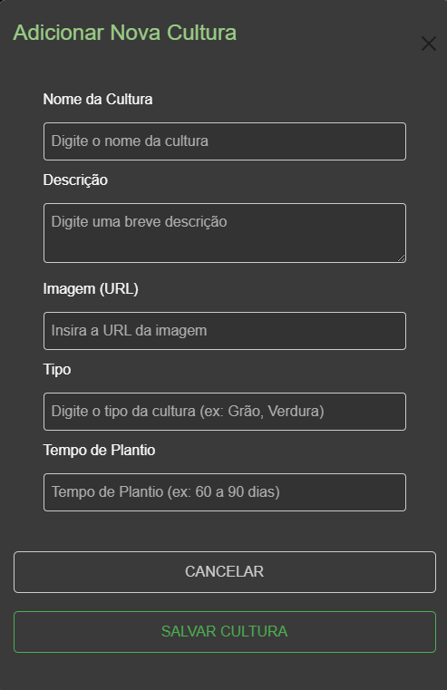
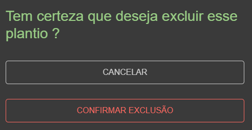
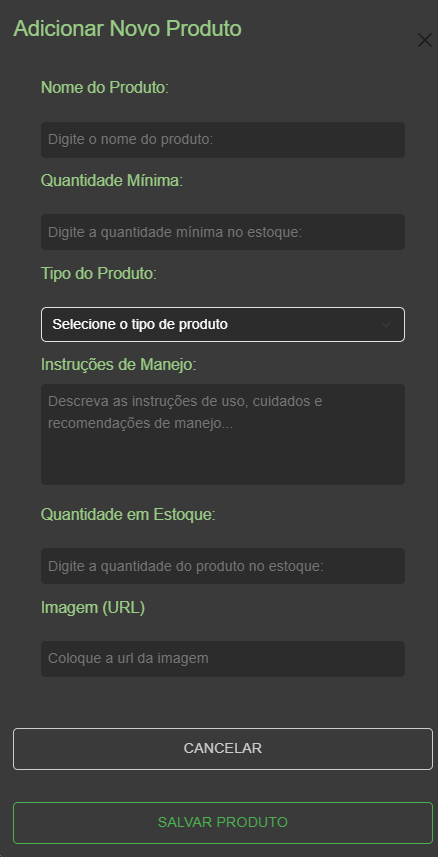

## 6. Interface do sistema

_Visão geral da interação do usuário por meio das telas do sistema. Apresente as principais interfaces da plataforma._

## 6.1. Tela principal do sistema

A página inicial do site G-AGRO dá as boas-vindas com um design simples e acolhedor, pensado para quem vive e trabalha no campo. No topo, você encontra o nome da plataforma e um menu fácil de navegar, com opções como Home, Login, Sobre e Contato. Além disso, há um menu lateral que permite ao usuário acessar facilmente todas as funcionalidades da plataforma.

Na seção principal, são apresentadas informações detalhadas sobre a G-AGRO, essenciais para que qualquer pessoa compreenda plenamente os benefícios e recursos da ferramenta. Complementando a experiência, há depoimentos de outros usuários, destacando suas experiências, e uma seção de perguntas frequentes para esclarecer dúvidas comuns.

## 6.2. Telas de Gerenciamento de cultura

No topo, há um menu de navegação e um botão para Adicionar Nova Cultura. As culturas cadastradas são exibidas em cartões com suas informações e um botão que permite a visualização com mais detalhes. No rodapé, encontram-se informações de direitos reservados e links para redes sociais

A tela "Adicionar Nova Cultura" apresenta um formulário simples para cadastrar culturas agrícolas. Os campos incluem nome, descrição, URL para imagem, tipo e tempo estimado de plantio. Dois botões na parte inferior permitem cancelar ou salvar a nova cultura, otimizando a gestão de informações de culturas.

A tela "Detalhes da Cultura" exibe informações específicas de uma cultura cadastrada. Mostra o nome, imagem, tipo, descrição, e tempo de plantio em dias. Na parte inferior, há botões para Editar, Fechar ou Excluir a cultura, facilitando sua gestão no sistema.

A tela "Editar Cultura" permite atualizar informações de uma cultura agrícola, incluindo imagem, nome, tipo, descrição e tempo de plantio. Possui botões para Cancelar e Salvar as alterações, com um design simples e funcional.

A tela excluir cultura possui um botão para confirmar a exclusão e outro para desistir da ação.

## 6.3. Telas do Gerenciamento de plantio

A interface apresenta um design limpo e organizado, com foco nas informações sobre as plantações cadastradas. Cada item exibe detalhes claros sobre a cultura e o terreno previamente vinculados ao plantio.

A navegação é simplificada, com opções de acesso rápido posicionadas na parte superior da página, incluindo botões para o cadastro de novos plantios e para a visualização do calendário, que direcionam o usuário para telas específicas. Além disso, cada plantio conta com botões de ação destacados, permitindo acessar mais detalhes de forma prática e intuitiva. Essa estrutura proporciona uma experiência eficiente e agradável para o usuário.

A tela permite gerenciar terrenos e culturas, sendo dividida em três seções: cadastro de terrenos, com formulário para adicionar informações como nome, tipo de solo e status; lista de terrenos cadastrados, exibindo detalhes e status de ocupação com opção de filtro; e seleção de culturas, apresentando opções disponíveis para plantio com ícones e botões para mais detalhes.

A tela de detalhes do plantio exibe informações como data de plantio , tamanho do terreno e nome do terreno . Inclui opções para Editar, Fechar ou Excluir, com design claro e funcional.

A tela de edição de plantio permite ajustar informações como o nome da cultura, data de plantio  e o terreno associado. Há botões para Cancelar ou Salvar as alterações, oferecendo controle claro e direto para gerenciar os dados do plantio.

A tela excluir plantio possui um botão para confirmar a exclusão e outro para desistir da ação.

## 6.4. Telas do Gerenciamento de estoques

Oferece um design intuitivo para o gerenciamento de estoques agrícolas. No topo, há um menu para navegação rápida e um botão principal para Cadastrar Produto. Os produtos são organizados em categorias, como Sementes e Agrotóxicos, com informações sobre o estoque e opções de adicionar ou consumir itens. Há também uma função para consultar o Histórico de Consumo e gráficos que facilitam a análise visual do estoque. 

A tela permite gerenciar o estoque, sendo dividida em diversos campos para serem preenchidos com o produto que entrará para o estoque, possui o botão salvar para concluir a ação e cancelar para desistir de cadastrar o produto.

A tela de detalhes do estoque exibe informações sobre aquele produto selecionado. Inclui opções para Editar ou Excluir, com design claro e funcional.

 A tela de adicionar quantidade permite que o usuário faça adição de quantidade de um produto ja existente no seu estoque.

 

 A tela de consumir produto permite que o cliente reduza sua quantidade em estoque para conseguir manter um controle de qual produto esta em falta ou não.

 

A tela de edição de produto permite ajustar informações sobre o produto selecionado. Há botões para Cancelar ou Salvar as alterações, oferecendo controle claro e direto para gerenciar os dados do produto.

## 6.5. Telas do Gerenciamento de colheitas

A tela é organizada em várias seções, com a principal sendo dedicada à exibição dos itens de colheita, devidamente classificados por status. Há também um menu que facilita o cadastro de novas colheitas e o acesso ao calendário.

Ao rolar a página, o usuário encontra gráficos informativos que oferecem uma perspectiva visual dos dados relacionados às colheitas, proporcionando uma análise mais completa e intuitiva. Essa estrutura bem planejada garante uma navegação eficiente e uma experiência enriquecedora para o usuário.

A tela permite gerenciar as colheitas, sendo dividida em diversos campos para serem preenchidos com a colheita que entrará ficará salva, possui o botão salvar para concluir a ação e cancelar para desistir de cadastrar a colheita.

A tela de detalhes da colheita exibe informações sobre aquela colheita selecionada. Inclui opções para Editar,Realizar colheita, Esconder detalhes ou Excluir, com design claro e funcional.

A tela de edição de colheita permite ajustar informações sobre a colheita selecionada. Há botões para Cancelar ou Salvar as alterações, oferecendo controle claro e direto para gerenciar os dados do colheita.

Essa tela apresenta um calendário mensal que organiza as atividades relacionadas às culturas cadastradas. Cada tarefa é representada em seu respectivo dia, com etiquetas claras que indicam as ações planejadas, como plantio, colheita, irrigação ou aplicação de insumos. O design permite visualizar de forma rápida e eficiente os compromissos agrícolas ao longo do mês, facilitando o planejamento e a gestão do tempo para o produtor.

A tela cadastrar um novo lembrete, sendo dividida em diversos campos para serem preenchidos com o lembrete que entrará ficará salvo no calendário, possui o botão adicionar lembrete para concluir a ação.

