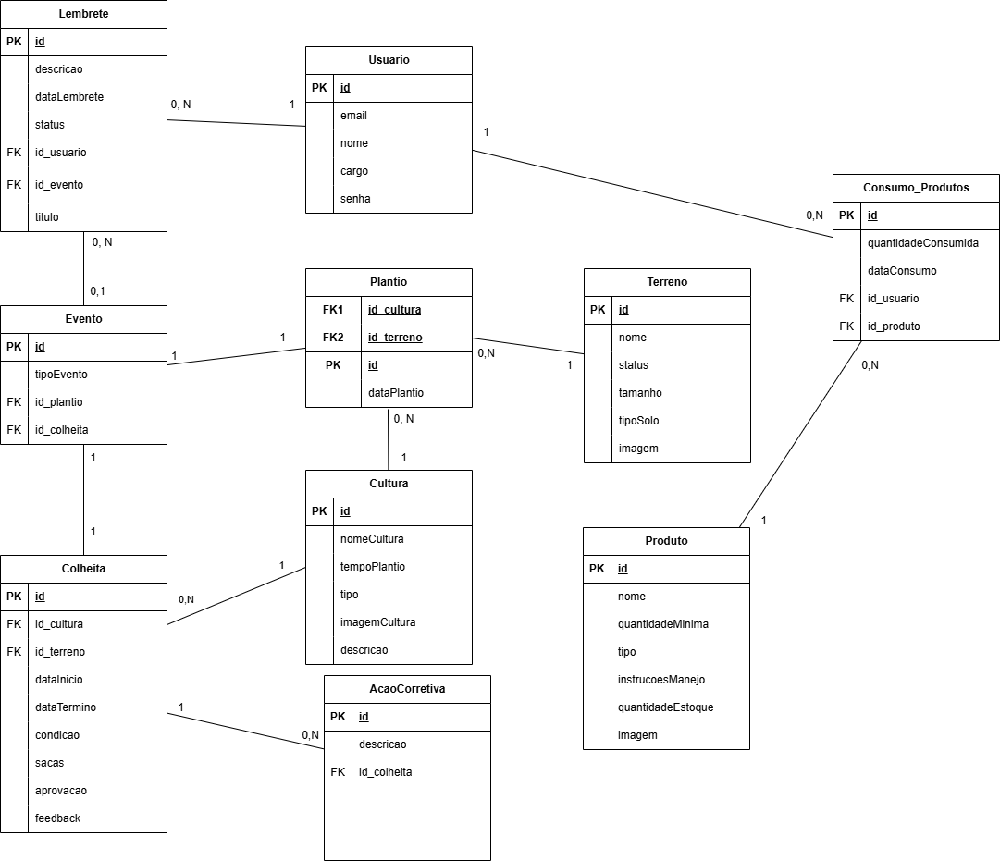

## 4. Projeto da solução

### 4.1. Modelo de dados

---

### 4.2. Tecnologias

| **Dimensão**   | **Tecnologia**  |
| ---            | ---             |
| SGBD           | PostgreSQL           |
| Front end      | HTML+CSS+JS+React+Bootstrap  |
| Back end       | Java SpringBoot |
| Deploy         | Vercel(Estático) + SupaBase(Backend)  |

